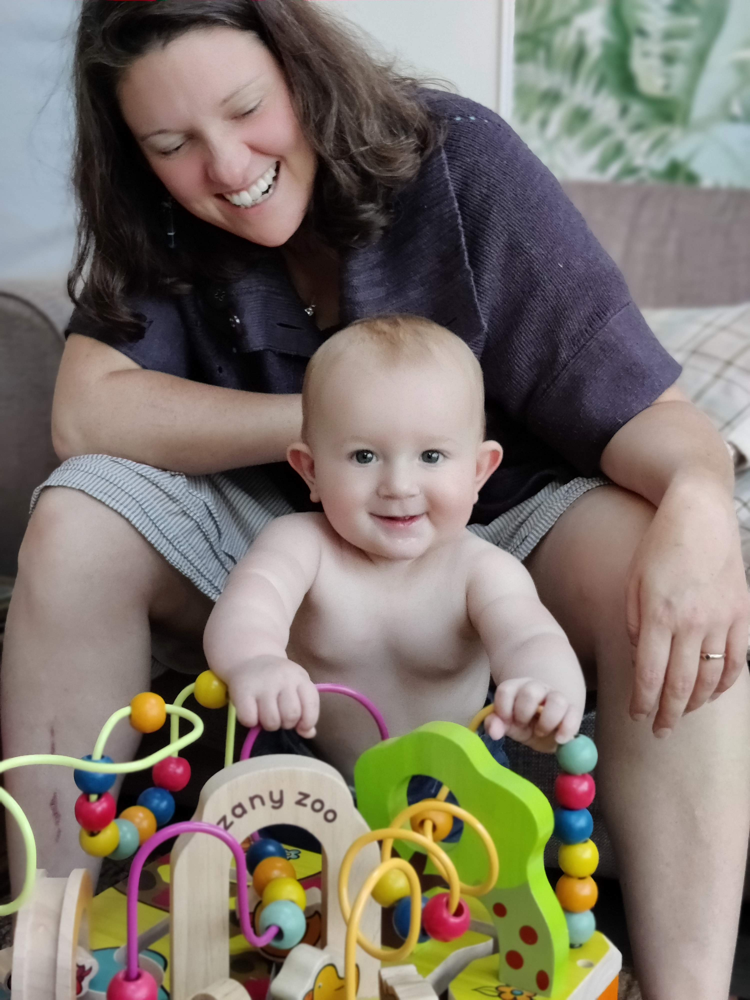

This observation section is starting a bit late, so a few milestones have been missed. I'll jumble them all up in here though and then try and be a bit more on the ball from now on. 

Joel is 8$\frac{1}{2}$ months now. 

* Rolling over - not interested. He has done it but only a few times. What's the point eh?
* Sitting up - this is Joel's strongest trick. He probably mastered it at 8 months. Very stable at it now
* Babbling - he loves a bit of "wawawa" and "bababa"
* Moving - this last week he has tried to go from sitting to lurching at nearby objects. He is precariously close to moving. If left sitting, he does end up in a different place after a few minutes. A little bit of bum shuffling for sure
* Standing - this will be his next trick. The last couple of weeks all he wants to do is hold your fingers to stand up. He is getting very stable at it. He is now trying to grab furniture to pull himself up on. He loves it and can do this for hours

{width=50%}

* Laughing - he has a great laugh. When he was a bit younger he would find things hysterical and get the hiccups. This doesn't happen so much anymore. He has a good sense of humour. There are times in the day where the two of us sit there laughing with each other for quite a long time because we've shared a funny moment
* Group participation - we have a few regular events organised. He finds them very interesting. He spends most of the time straight faced looking around and trying to take it all in. 
