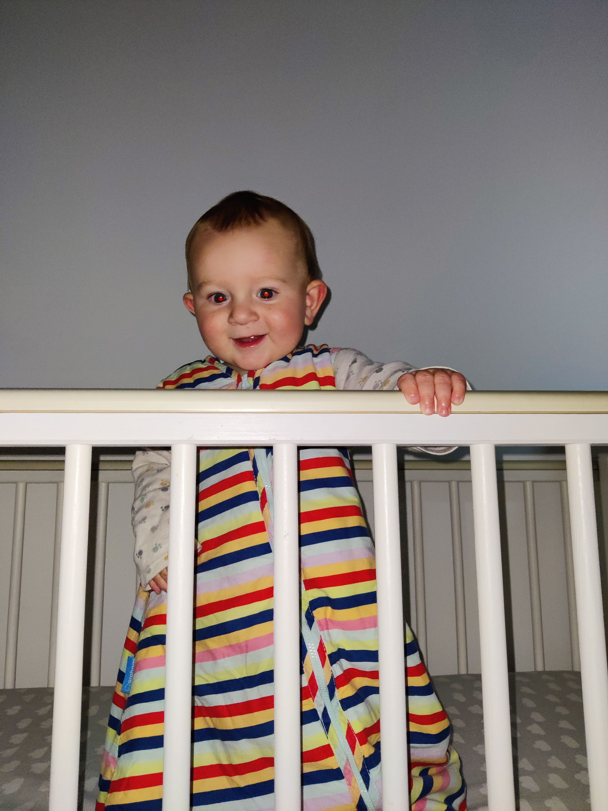

The last couple of weeks has felt like Joel has suddenly discovered he can work out how to do a lot of things. In what feels like a very short space of time, he has worked out how to clap, though not yet on command and certainly not when everyone else is clapping. He has then discovered waving, but again, his timing isn't quite there yet. His waves are very gentle. They involve a little wrist rotation combined with all 4 fingers of his hand bowing in tandem. Beautifully elegant.

Finally, on Sunday night (that's Sunday 17th October 2021, he is 9$\frac{1}{2}$ months), Mummy smuggles him off upstairs for a bit of quiet play away from Kirsten and me, and minutes later she's shouting "he's crawling". What a little monkey. His style involves pushing off with a foot while dragging his other leg along the ground. This has immediately caused us (Mummy) to tidy up a Joel-height shelf in the kitchen with lots of tiny things in it to make is Joel-safe. Parenting difficulty levels have now multiplied. An example of this is last night, when being put to bed, which he is generally very very good at, he realised he could experiment in his cot. Next thing I know he is climbing his bars and bouncing up and down with a huge grin on his face. 

