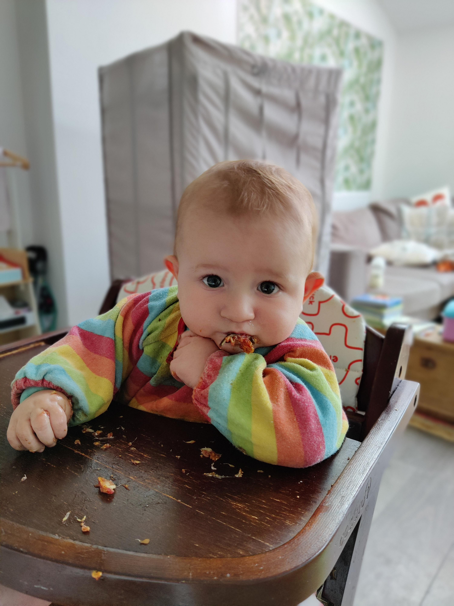

At the time of writing, Joel is just over 8 months old. This is what he looked like this evening after he finished devouring a fig:

He's had his first real cold this week. Struggled with breathing through his nose, and been up a lot at night as a result. **Very** snotty - lovely.

Joel can do a few tricks. He is good at sitting up on his own. He is desparate to stand. Today we had nothing organised and spent almost twenty minutes on the floor in the kitchen repeating this:

* Joel puts out hands
* Daddy provides hands to hold
* Joel grabs Daddy's hands and pulls himself up
* Joel stands for 10 seconds
* Joel releases Daddy's left hand
* Joel almost falls over but Daddy catches Joel
* Joel sits down

There we have it. He is very determined though and he keeps on going. It's amazing and great to watch and be a part of.

He is delightful. Very smiley, very friendly, and very adaptable. When he's hungry he will shout/scream, with increasing frequency if I haven't responded. 

At the moment he has no interest in crawling. He can be on his hands an knees for a few seconds before giving up and just lying, face planted, on the floor. He doesn't get upset though - he'll just crane his neck and look around. To move, he is looking like he might end up shuffling on his bum. He has at times been sitting in one place in a room when I've left it, and then sitting in another when I return (with no outside interference). 

He is quite chatty too. He makes a few noises. He used to do a lot of raspberries, but that has stopped. He's now doing "wawawa", and "bababa" fairly regularly. 

Finally, he has an amazing laugh. His laugh makes you laugh. When he laughs a lot he gets the hiccups.